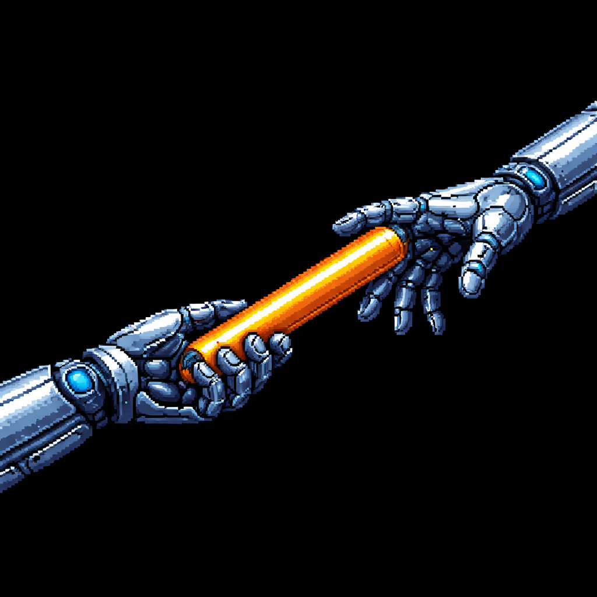

# Foundry

Foundry is a collection of Cursor plugins designed to optimise your agentic coding workflows.

## Plugins

### Primer

Primer audits and scaffolds a repository to ensure it is optimally configured for agentic development with Cursor. These skills are configured with `disable-model-invocation: true` to ensure they are only triggered when explicitly requested.

#### Components

| Type  | Name                        | Description                                                                                                     |
| :---- | :-------------------------- | :-------------------------------------------------------------------------------------------------------------- |
| Rule  | `keep-agent-mds-up-to-date` | Keep project documentation up to date when code changes make them stale.                                        |
| Skill | `agents-md`                 | Deep codebase initialisation with hierarchical AGENTS.md documentation and updating of AGENTS.md documentation. |
| Skill | `generate_agent_docs`       | Initialise comprehensive hierarchical AGENTS.md documentation across the entire codebase.                       |

### Relay

Relay bridges the gap between AI coding sessions. It equips Cursor with skills for structured handoffs and git diff context — giving agents the awareness they need to stay aligned with your current work, no matter when or where they pick up the thread. These skills are configured with `disable-model-invocation: true` to ensure they are only triggered when explicitly requested.

#### Components

| Type  | Name                              | Description                                                                    |
| :---- | :-------------------------------- | :----------------------------------------------------------------------------- |
| Skill | `git-diff-all-changes-main`       | Show all changes between the current branch and the merge base of origin/main. |
| Skill | `git-diff-committed-changes-main` | Show committed changes between origin/main and HEAD.                           |
| Skill | `git-diff-staged-changes-main`    | Show staged changes compared to the merge base of origin/main.                 |
| Skill | `handoff`                         | Create a comprehensive AI context handoff document for long-running sessions.  |

## Validation

To validate these plugins, run `node scripts/validate-template.mjs`.

## Attributions

- Repo initialised from <https://github.com/cursor/plugin-template>.
- generate_agent_docs skill was created from the deepinit skill in <https://github.com/Yeachan-Heo/oh-my-claudecode>.
- Relay logo generated with ChatGPT.
- Foundry and Primer logos generated with Gemini nano banana.
