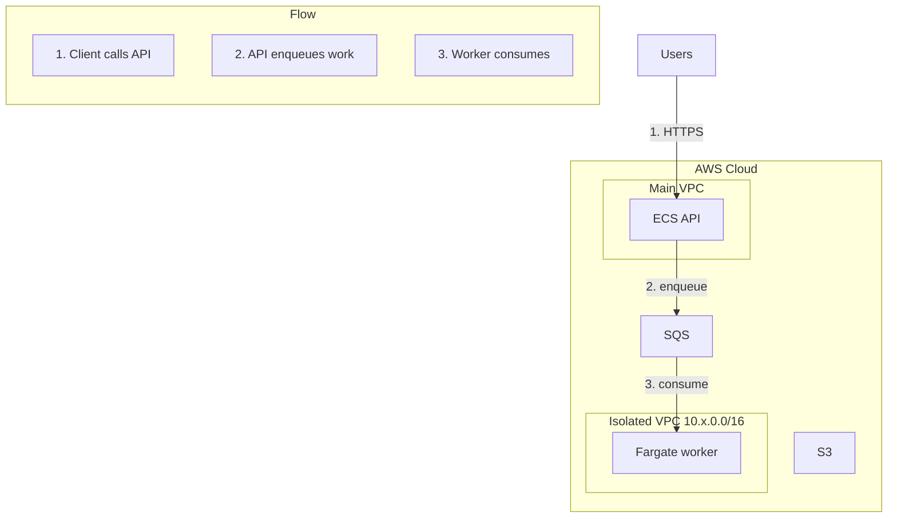

# AWS Architecture Diagram

Generate AWS architecture diagrams as **Mermaid** `flowchart TB` diagrams. Do not write draw.io XML, `.drawio` files, or diagrams.net preview URLs. Do not call or require a host-specific AWS plugin. See `references/vendor.md` for provenance.

## Purpose

Show account boundary, VPCs, and data flow the way an AWS reference diagram would: title, numbered steps, a legend when the flow branches, nested containment (AWS Cloud → VPC → subnet/cluster), orthogonal left-to-right or top-to-bottom flow.

## Placement overlay

- Output location: write to `.foundry/architecture-diagrams/<descriptive-name>.md`, creating the directory with `mkdir -p` when it does not exist. Do not commit the diagram unless the user asks.
- Do not terraform apply. Do not edit production infrastructure.
- **Same-account placement.** App servers, APIs, batch producers, and any other compute that runs in the AWS account stay **inside** the `AWS Cloud` subgraph. Put them in the product VPC as service nodes (ECS/Fargate/EC2), not as Users nodes outside the cloud. Isolated VPCs are **sibling** subgraphs in the same `AWS Cloud`. Cross-VPC traffic that is actually SQS/S3 must be drawn through those regional services, not as peering unless the infra has a peering resource.
- Users / on-premises / third-party SaaS are the only nodes that sit **outside** `AWS Cloud`.
- If the user already named a concrete system, skip the extra "confirm the architecture" prompt and generate.

## Instructions

### Step 1: Determine mode

**Mode A — Codebase analysis:** If the user asks to analyse or scan the code, or points at a repo:

1. Scan CloudFormation, CDK, or Terraform (`resource "aws_*"`).
2. Extract services, relationships, VPC structure, and data flow.
3. If there is no AWS infrastructure, scan Dockerfiles, databases, APIs, ML stacks, and brokers and still draw them as labelled nodes inside or outside `AWS Cloud` as appropriate.
4. Confirm only when the target system is still ambiguous.
5. Ask the user a single multiple-choice question about which diagram type fits (use the host's structured-question capability if available, otherwise plain chat), unless the type is obvious (VPC/container for an isolated ECS plane).

**Mode B — Brainstorming:** If the user describes a stack or asks to brainstorm from scratch:

1. Ask 3-5 focused questions (purpose, services, scale, security, traffic).
2. Propose the architecture and data flow.
3. Iterate if needed, then generate.

### Step 2: Styling

- **Legend**: on by default for 7+ services or branching paths. Off only if the user says "no legend", "without legend", "skip steps", or "no sidebar".
- Render the mermaid in the chat reply as well as the file. Do not generate a diagrams.net URL.

### Step 3: Write Mermaid

Use this skeleton. Nest subgraphs only for real boundaries (account, region, VPC, subnet, cluster).

````markdown
# <Architecture title>

<One-line subtitle.>


````

Rules:

- `flowchart TB` (or `LR` only when the user asks for a wide pipeline).
- Node IDs: camelCase or snake, no spaces, never `end`.
- Labels in quotes. Put the service name on the node (`ECS Copilot API`), not on the subgraph.
- Edges connect **service nodes**, not subgraph IDs. Number primary edges (`|"1. …"|`).
- Regional services (S3, SQS, ECR, Route 53, IAM) sit in `AWS Cloud` but **outside** VPC subgraphs unless they are VPC endpoints the user asked to show.
- Auxiliary (CloudWatch, CloudTrail, X-Ray, IAM): a dashed-note subgraph inside `AWS Cloud` with no step numbers and no edges, or omit unless asked.
- Every other service is primary: at least one numbered edge.
- Do not invent peering, IGWs, or NAT gateways the infra does not have.
- Mermaid gotchas: no `end` as an ID; quote labels that contain parentheses or colons; avoid `()` in unquoted node text; do not use HTML in node labels.

Optional `classDef` (keep it light; common Mermaid renderers support it):

```mermaid
classDef vpc fill:#f3e8ff,stroke:#8C4FFF,color:#232F3E
classDef subnetPriv fill:#e8f4fc,stroke:#147EBA,color:#232F3E
classDef subnetPub fill:#e9f7e6,stroke:#248814,color:#232F3E
classDef ext fill:#f5f5f5,stroke:#666666,color:#333333
```

Apply `vpc` / `subnetPriv` / `subnetPub` / `ext` to the matching subgraphs and the Users node.

### Step 4: Write the file

1. Write `.foundry/architecture-diagrams/<descriptive-name>.md` with the title, subtitle, mermaid fence, and (if the legend is on) the same numbered steps as markdown below the fence so they remain readable if mermaid fails to render.
2. Do not write `.drawio`.
3. Tell the user: file path, diagram type and services, and alt text under 100 characters. Include the mermaid fence in the reply. No diagrams.net URL.

## Defaults

- Mode: brainstorm if there is no codebase context; analyse if they pointed at a repo or named a system in it
- Legend: always for 7+ services unless opted out
- File: markdown + mermaid fence, kebab-case name, new file unless the user asked to update an existing diagram

## Stop conditions

- Stop after writing a valid mermaid markdown file (and showing it in chat)
- Stop and ask if the user wants a diagram of something that is not AWS and has no sensible node mapping
- Do not install host plugins, do not terraform apply, do not commit gitignored artefacts, do not emit draw.io or diagrams.net URLs

## Verification

Test: invoke this skill on a named AWS stack (Terraform/CDK/CloudFormation).

Pass:

- File exists under the output directory as `.md` with a `mermaid` fence
- `flowchart` with nested `AWS Cloud` and VPC subgraphs
- Numbered step edges (and a legend subgraph or list when 7+ services)
- In-account compute sits in a VPC subgraph **inside** AWS Cloud, not as Users outside the account boundary
- Isolated VPCs are sibling subgraphs in the same account; no invented peering
- No `.drawio` file and no diagrams.net URL

Fail: plugin required; in-account compute drawn outside AWS Cloud; draw.io output; commit of the artefact without being asked.
